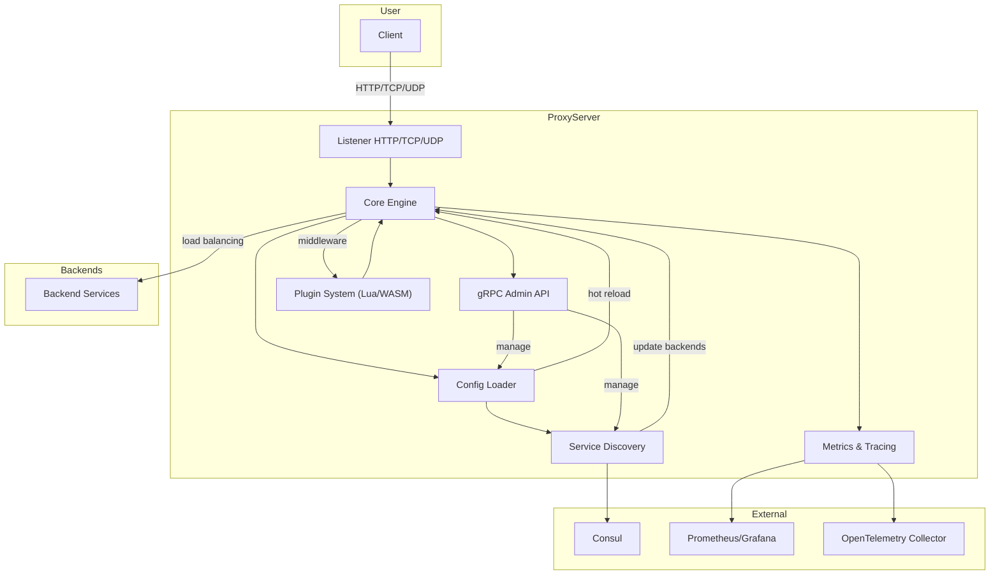

# High-Performance-Event-Driven-Proxy-Server

Production-ready event-driven proxy server written in Go.

## Architecture



## Features

| Фича                                   | Описание                                      |
|-----------------------------------------|-----------------------------------------------|
| ⚡ HTTP(S)/TCP/UDP Proxying             | Прокси для HTTP(S), TCP и UDP                 |
| 📈 Horizontal Scaling                   | Горизонтальное масштабирование                |
| ♻️ Hot Reload Configuration             | Горячая перезагрузка конфигурации             |
| 🚦 Zero Downtime Deploy                 | Развёртывание без простоя                     |
| 🛰️ gRPC API for Management              | gRPC API для управления                       |
| 🔍 Dynamic Service Discovery (Consul)   | Динамическое обнаружение сервисов (Consul)    |
| 🧩 Lua/WASM Plugin Support              | Поддержка Lua и WASM плагинов                 |
| 📊 Prometheus Metrics                   | Метрики Prometheus                            |
| 🕵️ OpenTelemetry Tracing                | Трассировка через OpenTelemetry               |

## Project Structure
```
cmd/proxy-server/      # Entry point
internal/core/         # Proxy engine
internal/config/       # Config loading, hot reload
internal/discovery/    # Service discovery
internal/plugins/      # Lua/WASM plugins
internal/api/          # gRPC API
internal/metrics/      # Metrics and tracing
pkg/                   # Shared libraries
configs/               # Example configs
test/                  # Integration tests
```

## Quick Start
1. Build: `go build -o proxy-server ./cmd/proxy-server`
2. Run: `./proxy-server`
3. Config: see `configs/example.yaml`
4. Metrics: `http://localhost:9100/metrics`
5. gRPC API: `localhost:9090`

## Docker
Build and run:
```
docker build -t proxy-server .
docker run -p 8080:8080 -p 9000:9000 -p 9001:9001 -p 9100:9100 -p 9090:9090 proxy-server
```

## Testing
Run all integration tests:
```
go test ./test/ -v
```

## Troubleshooting
- **Port already in use:**
  - Stop any process using the port (e.g. `lsof -i :8080` and `kill <PID>`), or run Docker with different ports.
- **Consul connection refused:**
  - Start Consul locally: `docker run -d --name=consul -p 8500:8500 consul`
  - Or disable discovery in config if not needed.

## License
MIT 